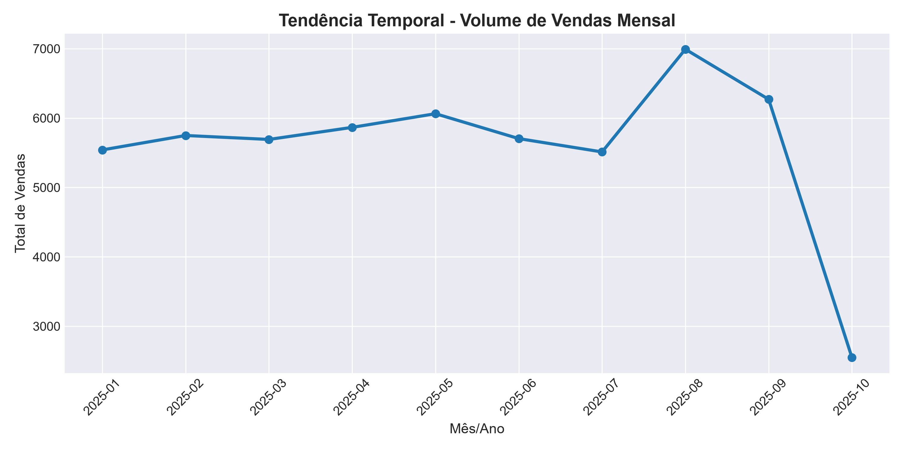
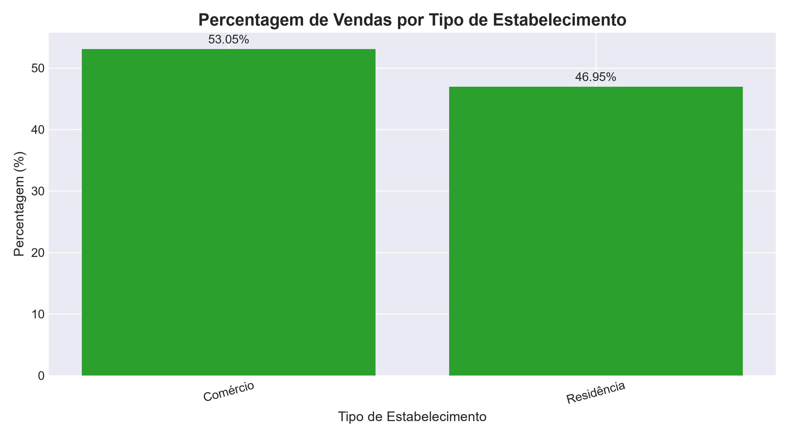

# Projeto de Análise Comercial e ETL 
Pipeline automatizado em Python para tratamento de dados, auditoria de inconsistências, cruzamento de bases relacionais e geração de indicadores de desempenho comercial (KPIs).

## Ferramentas e Tecnologias
* **Python** (Pandas, NumPy, Matplotlib)
* **VS Code** e ambiente Windows
* **Git** para controlo de versão

## Visualizações de Dados

